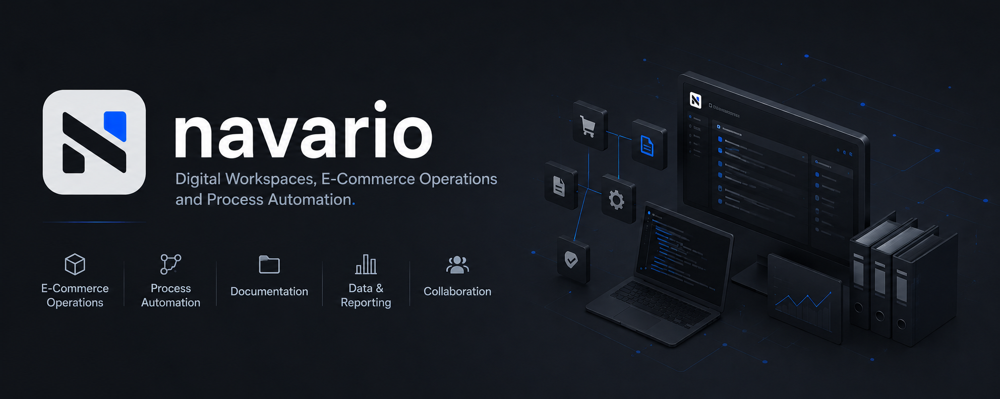

  

# Navario

**Digitale Workspaces, E-Commerce Operations und Prozessautomatisierung.**

Navario entwickelt strukturierte Systeme für E-Commerce-Prozesse, Dokumentation, Datenanalyse und workspace-basierte Zusammenarbeit.

Der erste praktische Fokus liegt auf JTL-basierten Service Operations: ERP-Workflows, Supportstrukturen, Datenqualität, Reporting und wiederverwendbaren Workspace-Konzepten.

## Fokus

- E-Commerce Operations und ERP-Workflows
- JTL-Wawi, JTL-Workflows und JTL-Ameise-Prozesse
- GREYHOUND-Supportstrukturen und Service Operations
- Data Insights, Reporting und Power-BI-Dashboards
- Kundenworkspaces und Dokumentationssysteme
- Prozessautomatisierung und wiederverwendbare Arbeitsstandards

## Aktueller Status

Navario befindet sich in der frühen Blueprint- und Aufbauphase.

Grundsatz:

> Navario ist nicht JTL. JTL ist der erste starke Use Case.

## Repositories

Öffentliche Repositories werden ergänzt, sobald erste Plattform-, Dokumentations- oder Tooling-Bestandteile bereit sind.

Interne Blueprint-Repositories dienen aktuell dazu, Strategie, Leistungen, Workspace-Konzepte und Umsetzungsplanung sauber zu strukturieren.

## Links

- Website: https://navario.io

---

## English

**Digital workspaces, e-commerce operations and process automation.**

Navario builds structured systems for e-commerce operations, documentation, data insights and workspace-based collaboration.

The first practical focus is JTL-based service operations: ERP workflows, support structures, data quality, reporting and reusable workspace concepts.

Core principle:

> Navario is not JTL. JTL is the first strong use case.
